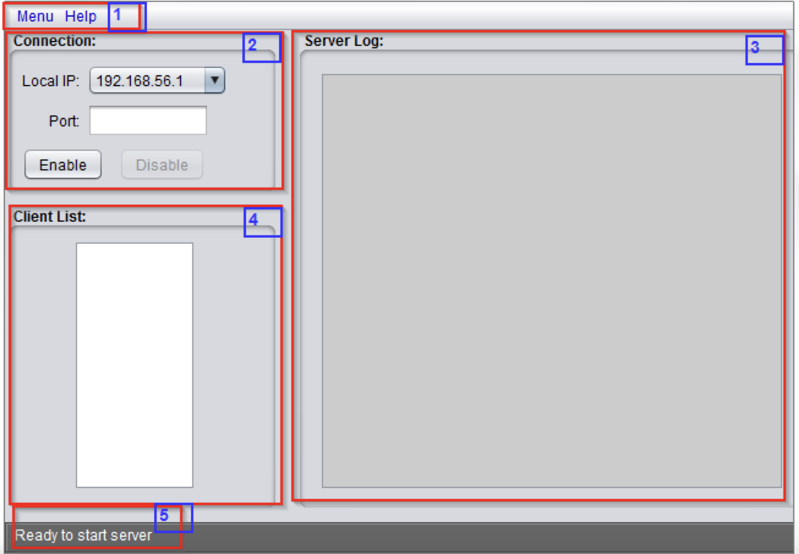
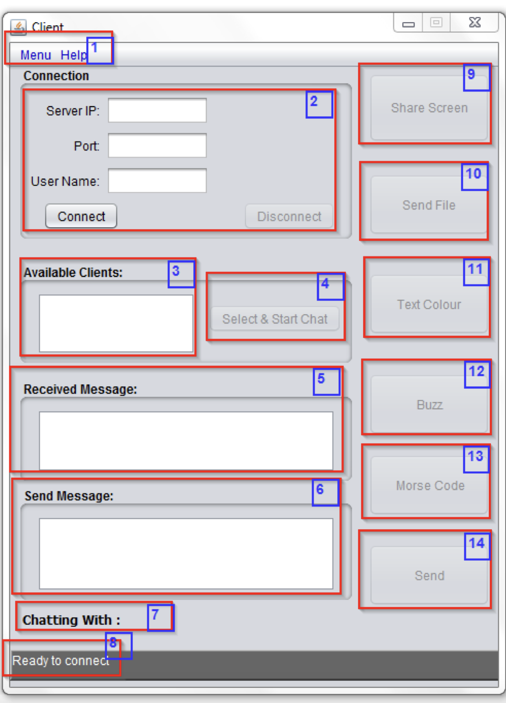

<!-- PROJECT LOGO -->
 

  

<h3 align="center">Client/Server Network Communication Application in Java </h3>

  

     
    <a href="https://github.com/EQITechG/Project_Application"><strong>Explore Repo »</strong></a>
     
    <a href="https://drive.google.com/file/d/1kcnb1Zl-Gk08B9sc6_5_mrI_uN16NvjN/view?usp=sharing">View Server Demo</a>
        
      <a href="https://github.com/EQITechG/Project_Application/raw/main/Client/Executable%20Client.jar">View Client Demo</a>
        
    ·
    <a href="https://github.com/EQITechG/Project_Application/issues">Report Bug</a>
    ·
  

<!-- TABLE OF CONTENTS -->

  
Table of Contents

  <ol>
    <li>
      <a href="#about-the-project">About The Project</a>
      <ul>
        <li><a href="#usage">Usage</a></li>
        <li><a href="#built-with">Built With</a></li>
      </ul>
    </li>
    <li>
      <a href="#getting-started">Getting Started</a>
      <ul>
        <li><a href="#installation">Installation</a></li>
      </ul>
    </li>
  </ol>

<!-- ABOUT THE PROJECT -->
## About The Project

A Client/Server Network Communication Application in Java

<!-- USAGE EXAMPLES -->
## Usage

Run Executable Server.jar

### Built With

* Java

<!-- GETTING STARTED -->
## Getting Started

Clone repo [https://github.com/EQITechG/Project_Application.git](https://github.com/EQITechG/Project_Application.git)

### Installation

========================
BUILD OUTPUT DESCRIPTION
========================

When you build an Java application project that has a main class, the IDE
automatically copies all of the JAR
files on the projects classpath to your projects dist/lib folder. The IDE
also adds each of the JAR files to the Class-Path element in the application
JAR files manifest file (MANIFEST.MF).

To run the project from the command line, go to the dist folder and
type the following:

java -jar "FinalProject2.jar" for server side
java -jar "FinalProject.jar" for client side

To distribute this project, zip up the dist folder (including the lib folder)
and distribute the ZIP file.

Notes:

* If two JAR files on the project classpath have the same name, only the first
JAR file is copied to the lib folder.
* Only JAR files are copied to the lib folder.
If the classpath contains other types of files or folders, these files (folders)
are not copied.
* If a library on the projects classpath also has a Class-Path element
specified in the manifest,the content of the Class-Path element has to be on
the projects runtime path.
* To set a main class in a standard Java project, right-click the project node
in the Projects window and choose Properties. Then click Run and enter the
class name in the Main Class field. Alternatively, you can manually type the
class name in the manifest Main-Class element.

